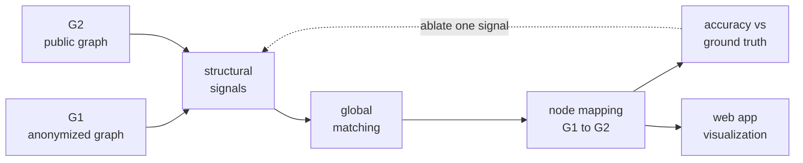
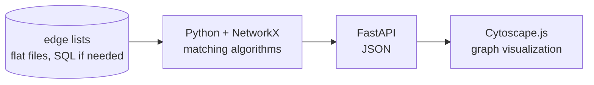

# Seed-Free Graph De-Anonymization

**Moe Myint Myat Maung, Nguyen Do, Christian Goethert, Tanvir Hossain**  
Project proposal — Fall semester, 1 September – 29 November 2026

## 1. Objective

Given an anonymized social graph and a second graph gathered from public sources, decide
which node in one is which node in the other, using only the pattern of connections. No
seed pairs, usernames, profile attributes, or community labels are given. All nodes are
matched at once. We measure how often the matching is correct, then look for conditions
that make it fail. A companion web app visualizes the matching, the decision threshold,
and the difference between ground truth and algorithm output.

## 2. Current practice and its limits

Seed-based attacks propagate a mapping outward from a small set of known correct pairs.
They work well but depend entirely on obtaining those seeds, which is often unrealistic.
Seed-free attacks remove that dependency. In the group's prior implementation, node
ranking by a centrality measure (PageRank, eigenvector, degree, k-core, k-truss) drives
the whole result, so the choice of measure is the dominant factor and accuracy degrades
when the two graphs differ structurally. Published work on the seed-free setting is thin,
which is itself part of the problem we want to characterize.

## 3. Approach

Start from the existing seed-free baseline and layer additional simple structural signals
onto it one at a time, keeping each addition separately testable. The aim is a matcher that
adapts across datasets rather than one tuned to a single graph. Every candidate signal is
cheap to compute and cheap to ablate, so any accuracy gain is attributable to a named
component rather than to the ensemble as a whole.

## 4. Why it matters

De-anonymization quantifies a concrete privacy risk for users of platforms that market
themselves on privacy. A working attack lowers the effort required for stalking and
targeted crime, which is why defense is the intended next step. The same techniques
underpin cross-platform consumer profiling and data-heavy pricing programs.

## 5. Risks

- Publishing a working attack, or the web app, could aid misuse. We will gate release and
  scope the app toward visualizing known results rather than a general-purpose tool.
- Ethical sourcing of real social graph data is unresolved. Synthetic graphs avoid this but
  may not be realistic enough to support conclusions.
- The seed-free literature is small, so scope may shift after the week 2 to 3 review.
- Cost is expected to be negligible; compute is local plus optional GPU.

## 6. Schedule and success criteria

| Weeks | Dates | Work |
|---|---|---|
| 0–1 | Sept 1 – 13 | Direction, ideation, proposal |
| 2–3 | Sept 14 – 25 | Literature review, algorithm survey |
| 4–7 | Sept 28 – Oct 25 | Implementation, dataset characterization |
| 8 | Oct 26 – Nov 1 | Midpoint check-in |
| 9–10 | Nov 2 – 13 | Continued research and evaluation |
| 11 | Nov 16 – 22 | MVP presentation |
| 12 | Nov 23 – 29 | Progression from checkpoint, scoping for spring |

**Midpoint:** several benchmark datasets characterized by degree distribution, component
count, centrality, and PageRank (etc); the baseline seed-free algorithm fully reimplemented and
reproducing its reported accuracy; at least one exploratory algorithm of our own.

**End of semester:** a result that is publishable or a clearly argued path toward
publication, plus a rudimentary working web app.

## 7. Technical plan

Storage starts as flat edge-list files and moves to SQL only if dataset size forces it for product presentation.
